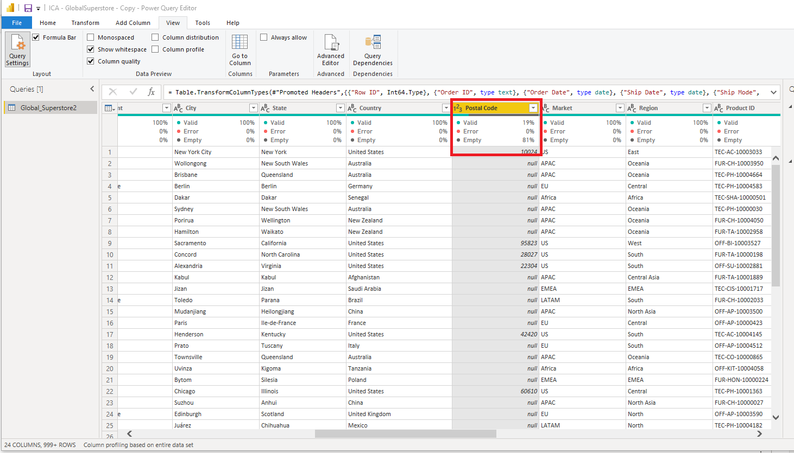
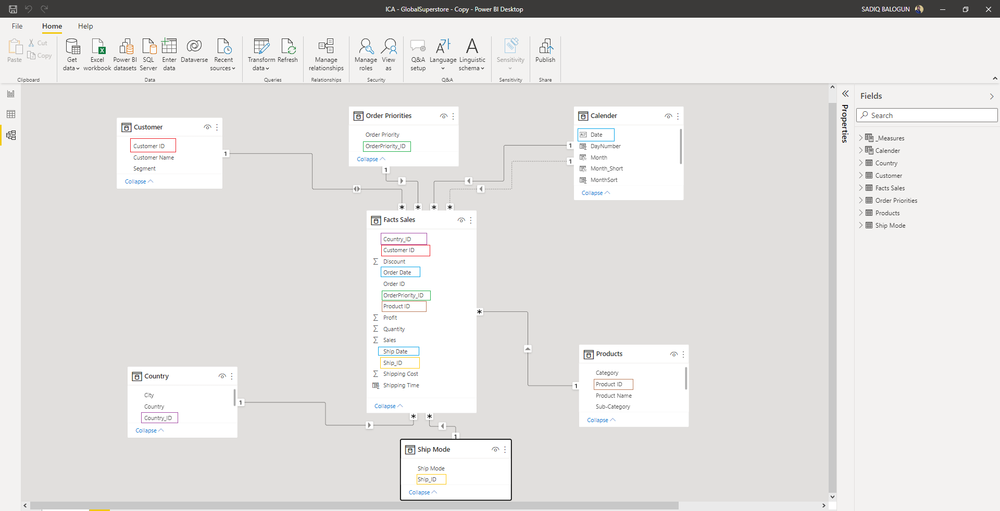
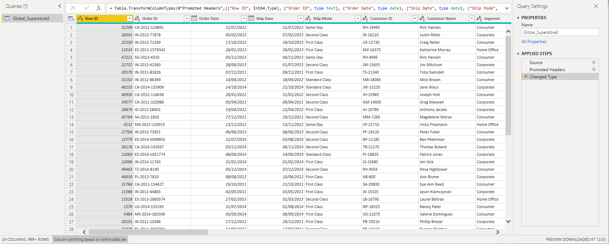
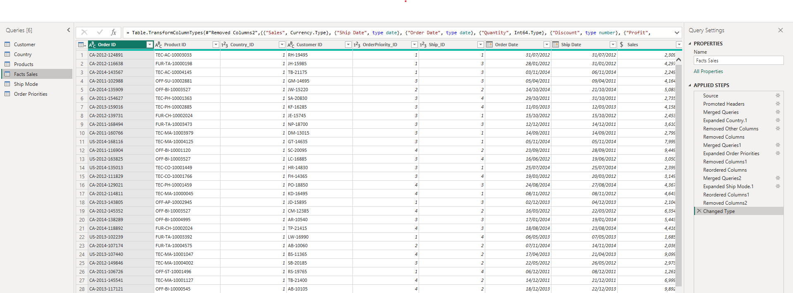
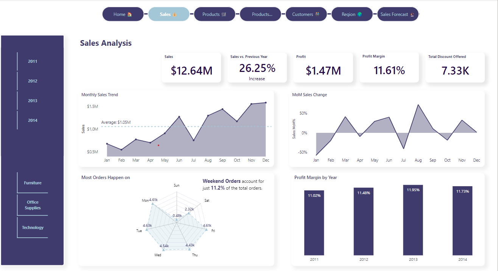
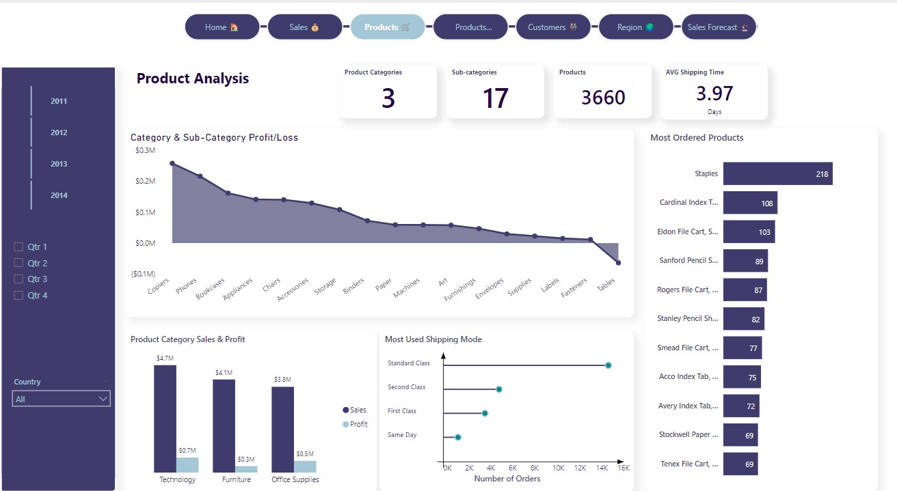
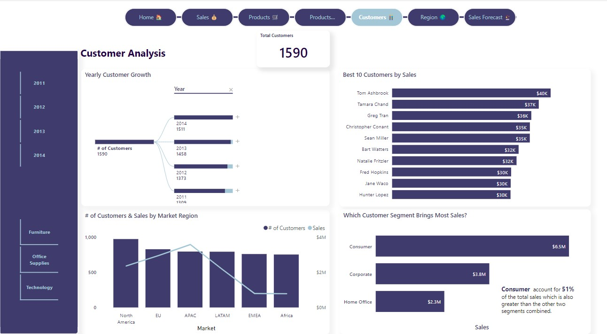
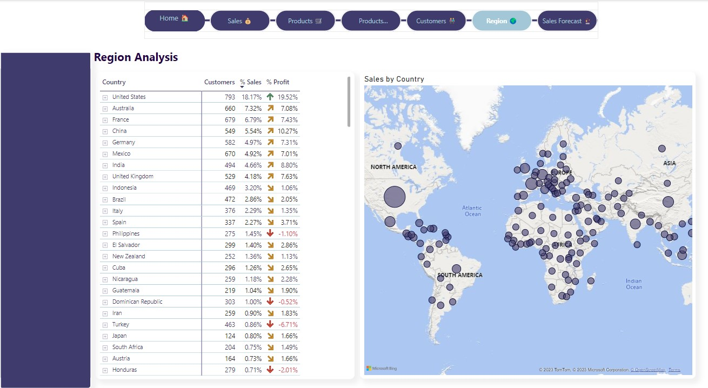
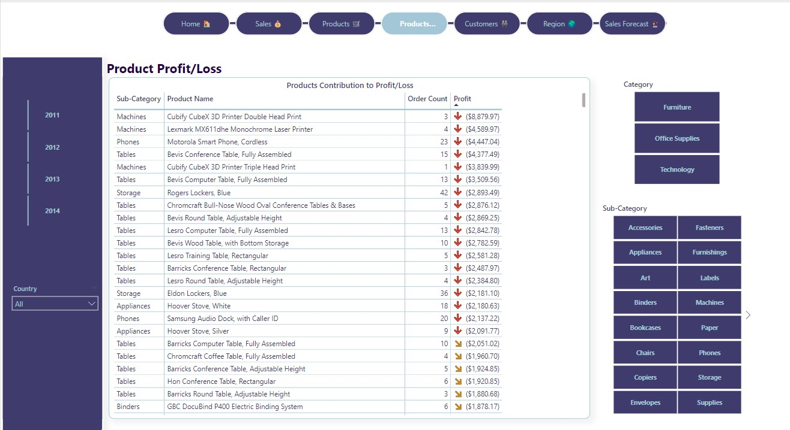

# Global Superstore Analytics

## INTRODUCTION
In today's data-driven society, having an intelligent strategy is essential for businesses to thrive. With the availability of numerous data sources, organizations can utilize data to make informed decisions, forecast future events, and achieve their strategic objectives. Continuous visibility into business performance and the ability to measure key performance indicators are crucial for success.

## OBJECTIVE
This project aims to use business intelligence tool to analyse the performance of a global superstore. The outcome of this analysis will assist stakeholders in making educated decisions about how to attain their goals.

## DATA SOURCE
This project’s data is open source, it is the Global Superstore dataset obtained from Kaggle. The data can be accessed via this [link](https://www.kaggle.com/datasets/apoorvaappz/global-super-store-dataset?select=Global_Superstore2.csv). The dataset is in a CSV format with 51,290 observations and 24 features.

## BI QUESTIONS
This project focuses on descriptive and predictive analytics using the available historical data. The following questions will be addressed through the analysis:
*	What is the monthly trend of sales? 
*	What day of the week do we receive most orders?  
*	Which products do our customers order most?  
*	Where are we making profits/loss in terms of product categories?  
*	Are we losing or gaining customers over the years?  
*	Do we have the most sales in region with highest number of customers?  
*	Who are our best customers?  
*	Which type of customer segment brings the most sales? 
*	How many customers do we have per country, and what is their sales contribution percentage?  What’s the most preferred shipping mode? 
*	How long on average does it take us to ship our products? 
*	What is the sales forecast for the next two years?

## DATA CLEANING AND TRANSFORMATION
To prepare the data for analysis, several pre-processing steps were performed using Power Query. These steps include removing null values, handling errors, changing data types, performing timeline checks, and creating new columns. The data was cleaned and transformed to ensure its suitability for analysis.  
 
* __Removing Null values:__ The postal code column contained 81% missing data; as the column would not contribute to the analysis, it was deleted.  
 

* **Handling Errors:** During the investigation, it was observed that "Canada" appears in the region column. This was modified to read "North America." This problem was resolved using the find-and-replace technique as seen below.  

* **Changing Data Types:** Since the values are monetary, the data type for the sales, profit and shipping cost was changed from a decimal number to a fixed decimal number.

* **Timeline Check/ Data Range:** The ship date and order date were sorted in descending order to ensure that there were no outliers in the dates. Both columns were discovered to be within the appropriate range as shown below.

* **Creating New Column:** Subtracting the order date column from the ship date column yielded the shipment time column. It is essential to know how long the products will take to ship. The new column's data type was changed to a whole number and its order on the table was rearranged as shown below.

## DATA MODELING - STAR SCHEMA
The star schema data model was applied to the dataset. The established dimension tables include customer, country, product, ship mode, order priorities, and calendar, all linked to the facts table through their primary keys. The dimensions and facts table have a one-to-many relationship, enabling efficient analysis and exploration of the data.

Before Modeling           | After Modeling
:-------------------------:| :-----------------------:
       | 

The below table shows the snapshot of the data before and after processing.

Before Data Processing | After Data Processing
:-------------------------:| :-----------------------:
  |  

## DATA ANALYSIS AND DASHBOARD
The data analysis was divided into sales performance analysis, product analysis, customer analysis, and region analysis. Using DAX and calculated columns, these analyses provided insights into various aspects of the superstore's operations. Each segment has a dedicated dashboard page that addresses the business intelligence questions raised. The interactive dashboard allows users to navigate and personalize the displayed information according to their specific needs.

 
 

## SUMMARY OF FINDINGS

* Since 2011, our platform has processed over 25,000 transactions for 1,590 customers. Only 11.2% of these transactions took place over the weekend.
* These deals generated $12.64M with a profit of $1.47M.
* Sales are up 26.25%  compared to the previous year. 
* Our sales are above average during the final three months of the year, with December being the strongest month and February being the worst.
* There are 3 product categories, 17 sub-categories, and 3,660 products in our inventory. The most profitable of the three product categories was technology, followed by office supplies and furnishings. 
* We suffered a $64,000 loss in the tables sub-category. 
* Staples is the most often ordered product, with 218 orders, followed by the cardinal index tab with 108 orders. 
* It was observed that the average transit time for all shipping modes is 3.97 days. The standard class has been utilised 15,154 times (highest) with an average shipment duration of 5 days. Second class mode was used 5,119 times with an average shipping time of 3.2 days. Few purchases (1,347) made use of same-day shipping. 
* In terms of sales, Tom Ashbrook, Jane Waco, and Bill Eplett are our best customers. 
* In comparison to other regions, the United States generated 18% of sales and 19% of profit. Turkey had the greatest decline, 6.7%.
* It is anticipated that sales will increase by 14.82 and 14.03% in 2015 and 2016, respectively. 

## RECOMMENDATIONS BASED ON FINDINGS

* Create awareness among "Home Office" customers to increase sales.
* The APAC region has the third-largest customer count, but the highest sales volume. Focus on acquiring more customers in the APAC region to boost revenue. 
* Transactions in Turkey result in losses across all categories, the majority of which are attributable to the office start swivel stool. An investigation needs to be done to know why.
* The Cisco Smart Phone Full Size generates the greatest profit with the fewest orders in the category of phones. To improve sales, it is necessary to enhance awareness. 
* The company incurs losses of $193 and $106 for each Motorola Smartphone and Samsung Audio Dock transaction, respectively. Their price should be re-evaluated.
* In the Machines sub-category, the average losses for the Cubify 3D printer and Lexmark laser printer are $3,178 and $1,147, respectively. Their price should be re-evaluated as well.

## CONCLUSION
In conclusion, this project utilized data analytics techniques to analyze the performance of a global superstore. Through the interactive dashboard and data insights, stakeholders can make informed decisions and take necessary actions to achieve their strategic objectives. By leveraging the power of data, businesses can drive growth, improve profitability, and stay competitive in today's dynamic market.
 

**The dashboard can be accessed and interacted with through the following link:** [Link to the Dashboard](https://app.powerbi.com/view?r=eyJrIjoiNzJjOTA0NDgtNDkxOS00ODlmLTk0MzQtZWIwMDc1YTZlYTc5IiwidCI6IjVmZjhkZDRiLTBiZDMtNGRjYS1hNjc2LTgzNmQwN2I0MWNhMSIsImMiOjh9&pageName=ReportSection88dcf553296e4e3790dc)

 
Thank you for reading!
